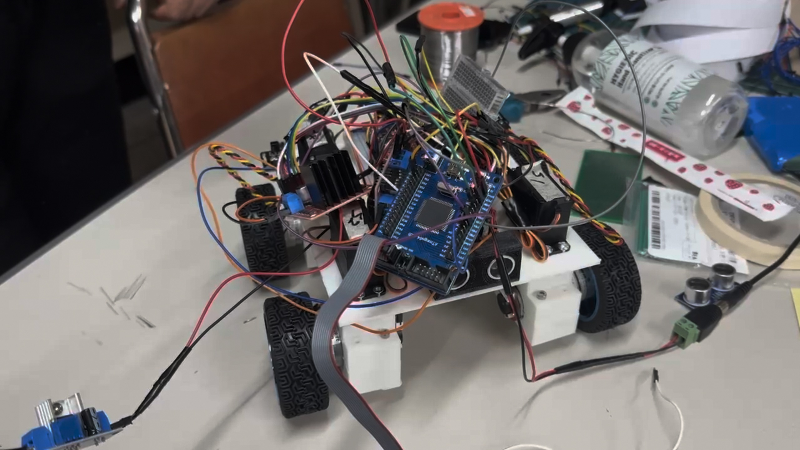

# embeded_system_design
임베디드 시스템 설계 최종 프로젝트 4륜 독립 제어 모빌리티

> **참고자료** 
> https://drive.google.com/drive/folders/15JHObH-ROBKEIcOnrB2xyCDq34mykMWX?usp=sharing

# 4륜 독립 제어 ADAS 모빌리티

## 개요

ATmega128 기반 4륜 독립 제어 모빌리티. 각 바퀴의 구동(DC)과 조향(서보)을 분리 제어하여 직선·수평 이동·제자리 회전·사선 주행을 수행한다. ADAS 일부 기능으로 초음파 전방 감지와 압력 센서 기반 핸즈 오프 경고를 포함한다. IR 리모컨으로 주행 모드 및 동작을 제어한다.

## 주요 기능

* 4륜 독립 구동/조향
* IR 리모컨 기반 주행 모드 선택 및 속도/방향 제어
* 초음파 센서 기반 전방 장애물 감지 및 비상 정지
* FSR 압력 센서 기반 핸즈 오프 감지 및 부저 경고
* 3× MCU 분산 아키텍처(DC/초음파, 서보/조향, FSR/부저)

## 시스템 사양

### 기구/전원

* 크기: 300 × 250 × 100 mm
* 무게: 3 kg
* 외형 재질: PLA
* 전원: Li‑ion 30,000 mAh

### 성능

* 최대 속도: 0.035 m/s
* 최대 가반하중: 10 kg
* 조향 각도: ±90°(총 180°)

### 프로세서/구동

* MCU: ATmega128A @ 12 MHz
* DC 모터: CHR‑GM25‑370(엔코더 포함), 감속 1:34, 토크 12 kg·cm, 350 RPM
* 서보: MG996R, PWM 50 Hz
* 모터 드라이버: L298N × 2ch

### 센서

* 초음파: HC‑SR04, 2 cm \~ 4 m, FOV 15°
* 압력: FSR‑406, 0.2 N \~ 20 N, 반복 정밀도 ±2%

### 개발 환경

* OS: Windows
* 언어/IDE: C / Microchip Studio

## 하드웨어 구성

* MCU(1): IR 수신 + DC 4륜 방향/속도 제어 + 초음파 장애물 감지
* MCU(2): IR 수신 + 서보 4개 조향 각도 제어(직선/수평/사선/제자리 회전)
* MCU(3): FSR 압력 측정 + 부저 경고(핸즈 오프)

## 사용 인터페이스 요약

| 블록   | 인터페이스               | 용도                                   |
| ------ | ------------------------ | -------------------------------------- |
| MCU(1) | 외부인터럽트             | IR 수신, HC‑SR04 Echo 측정             |
| MCU(1) | PWM                      | L298N ENA/ENB 속도 제어                |
| MCU(1) | GPIO                     | L298N IN1\~IN4 방향 제어, HC‑SR04 Trig |
| MCU(2) | PWM(16‑bit, Fast PWM 14) | 서보 4ch 조향 각도 제어                |
| MCU(3) | ADC                      | FSR 전압 분배 측정                     |
| MCU(3) | GPIO                     | 능동 부저 구동                         |

## 소프트웨어 구조

* 타이머/카운터

  * DC 속도 제어: Fast PWM, 8분주, L298N 권장 25 kHz 근처로 ICR 설정
  * 서보 조향: Fast PWM 14, 분주 8, TOP=ICR=29,999(50 Hz)
* IR 디코딩: NEC 프로토콜, 리드코드 검증 후 32비트 수신
* 초음파 거리: Trig 10 µs, Echo 상승/하강 에지 시간차로 왕복시간 계산, 임계 10 cm 이하 시 정지
* 핸즈 오프: 주기적 ADC 변환, 임계치 미만 지속 시 부저 ON

## IR 리모컨 매핑

| 키  | HEX      | 동작           |
| --- | -------- | -------------- |
| ↑   | 0xFF18E7 | 전진           |
| ↓   | 0xFF4AB5 | 후진           |
| ←   | 0xFF10EF | 수평 좌 이동   |
| →   | 0xFF5AA5 | 수평 우 이동   |
| *   | 0xFF6897 | 제자리 회전 좌 |
| #   | 0xFFB04F | 제자리 회전 우 |
| OK  | 0xFF9867 | 정지           |

## 조향 각도(PWM OCR)

서보 주파수 50 Hz, ICR=29,999 기준.

| 모드        | FL(OCR1A) | FR(OCR1B) | RL(OCR3A) | RR(OCR3B) |
| ----------- | --------: | --------: | --------: | --------: |
| 직선        |      2400 |      2400 |      2400 |      2400 |
| 사선(오)    |      1550 |      1550 |      1550 |      1550 |
| 사선(왼)    |      3150 |      3150 |      3150 |      3150 |
| 수평        |      3900 |       900 |       900 |      3900 |
| 제자리 회전 |      3150 |      1550 |      1550 |      3150 |

## 주행 모드별 DC 회전 방향 요약

* 직진/사선(전): FL/FR 시계·반시계 조합으로 전방 성분 정렬
* 후진/사선(후): 전진과 반대 조합
* 수평 좌/우: 전륜 동일 방향, 후륜 반대 방향으로 횡이동 벡터 형성
* 제자리 좌/우: 4륜 동일 방향 회전으로 요(yaw) 생성

## 동작 흐름

1. 부팅 → 주변장치 초기화(IR, PWM, 초음파, ADC)
2. IR 리드코드 유효성 검사 → 명령 디코딩
3. 서보 조향 세팅 → DC 속도/방향 설정
4. 초음파 주기 측정 → 10 cm 이내 감지 시 DC 정지
5. FSR 주기 측정 → 임계 미만 지속 시 부저 경고

